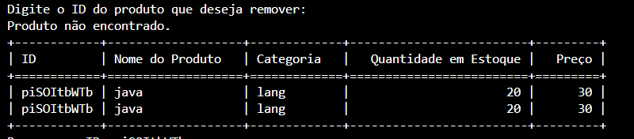

# Agil_Store
Este é um projeto simples que permite a gestão automatizada do inventário de produtos de uma loja de eletrônicos.

## Tecnologias utilizadas: Vscode, Git, Python 3.13 , Microsoft Copilot

### Teste o programa no seu computador
Passo 1: baixe e instale a última versão da liguagem Python no site oficial(www.python.org).

Passo 2:  Após baixar  e instalar o python, abra a prompt de comando e instale a biblioteca 'tabulate' com o comando: pip install tabulate.

Passo 3: No seu editor de códigos, baixe a extenção oficial para Python.

Passo 4: No Git Hub deste projeto, faça o clone para a sua máquina.

Passo 5: execute o arquivo "inventario.py" no prompt de comando integrado do seu editor de código.

Por fim, siga as instruções mostradas no prompt de comando e digite o que se pede.
